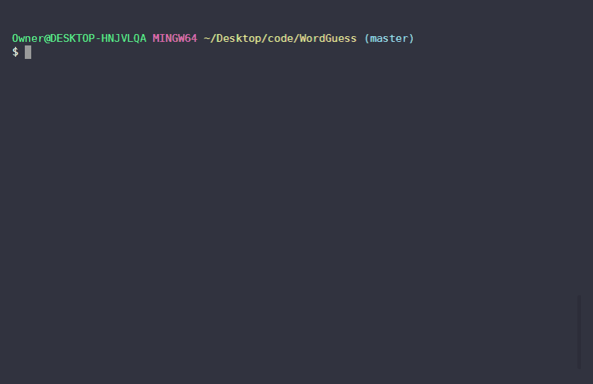

# Word Guess
Word Guess is a command line game. By default, you have eight chances to guess the name of a Super Smash Bros. Ultimate character. If you correctly guess the character, you'll be given a new character to guess; otherwise, the game ends.

## Running the Application
You will need Node.js to install the required node modules with `npm install`. To execute the game, open the terminal in the directory and use `node index.js`.

## Demo

